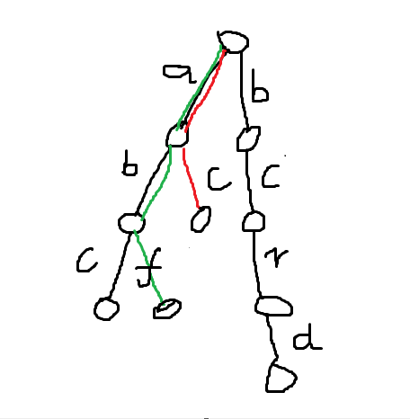

# 前缀树

> 在计算机科学中，trie，又称前缀树或字典树，是一种有序树，用于保存关联数组，其中的键通常是字符串。与二叉查找树不同，键不是直接保存在节点中，而是由节点在树中的位置决定。一个节点的所有子孙都有相同的前缀，也就是这个节点对应的字符串，而根节点对应空字符串。一般情况下，不是所有的节点都有对应的值，只有叶子节点和部分内部节点所对应的键才有相关的值。

通常，经典的前缀树中，值是在边上而非在节点上，节点仅为标识值的有无。

## 前缀树的生成？

前缀树是怎么生成的呢？对于一个仅包含26个字母的前缀树，我们可以通过以下过程生成一颗前缀树。

给定一些字符串：["abc", "bcrd", "ac", "abf"]

首先我们会有一个根节点，此时他并没有任何的边，连向任何节点。

对于字符串“abc”，读到字符“a”，发现还没有“a”的边，生成一条“a”的边，连接新节点，节点移动到新节点，后面的“bc”也是如此。

对于后面字符串，没有现成的边，就创建，有就复用。

以下就是由上面这些字符串最后生成的前缀树：



## 表示

当需要表示的字符较少，如仅表示26个英文字母时，可以使用数组表示。当字符数量较多且不确定时，通常使用哈希表。

### 节点

在画出的前缀树中，我们很容易看出一条边被复用几次（即是多少字符串的前缀），在哪里结束（当结束不是叶子节点也不容易看），下一层节点有哪些，可计算机没有办法知道。所以我们需要在，节点中记录当前节点**被经过的次数**，多少字符串在此**结尾**，以及指向下一层所有节点的指针。

因而我们可以将节点定义为：

```cpp
class TrieNode {
	TrieNode() : pass(0), end(0) {}
public:
	int pass;
	int end;
	std::map<char, TrieTree*> char_map;
};
```

前缀树TrieTree实例化时，会生成一个根节点，pass、end都为0。

### 插入

从根节点出发，遍历字符串字符：

- 读取一个字符，意味着越过一个节点，节点pass++；
- 读取字符的时，如果该边不存在，则生成，存在则复用；
- 字符读完之后，指针停在最后一个节点，节点pass++，end++。

```cpp
/*
 * insert string str
 * return the end count of the end node
 */
int TrieTree::insert(std::string &str) {
	TrieNode *cur = _root;
	for (auto ch : str) {
		cur->pass++;
		if (cur->char_map.find(ch) == cur->char_map.end()) {
			cur->char_map.insert({ch, new TrieNode()});
		}
		cur = cur->char_map[ch];
	}
	cur->pass++;
	return ++(cur->end);
}
```


### 查找字符串

从根节点出发，遍历字符串字符：

- 如果有某个字符路径不存在，直接返回0，说明字符串没有添加过；
- 如果存在的话，一定会遍历到字符串末尾，返回去end值即可。

```cpp
// find string & return end count
int TrieTree::search(std::string &str) {
	TrieNode *cur = _root;
	for (auto ch : str) {
		if (cur->char_map.find(ch) == cur->char_map.end()) {
			return 0;
		}
		cur = cur->char_map[ch];
	}
	return cur->end;
}

```


### 查找前缀次数

从根节点出发，遍历字符串字符：

- 如果有某个字符路径不存在，直接返回0，说明该前缀一定不存在；
- 如果存在，一定会停在最后一个字符的路径的尾部，返回其pass值即可。

```cpp
// find prefix count (return pass)
int TrieTree::prefixSearch(std::string &str) {
	TrieNode *cur = _root;
	for (auto ch : str) {
		if (cur->char_map.find(ch) == cur->char_map.end()) {
			return 0;
		}
		cur = cur->char_map[ch];
	}
	return cur->pass;
}
```


### 删除字符串

首先，我们需要判断该字符串是否存在，如果不存在，直接返回0。这里的返回值表示该删除的字符串剩余的个数。

如果存在，开始遍历字符串，沿途位置pass--，如果遇到pass为0，将该节点释放，并跳转到下一层节点，最后一定会停在end字符的节点，判断其pass值，决定节点是否释放，返回end。

```cpp
int TrieTree::del(std::string &str) {
	if (search(str) == 0) {
		return 0;
	}
	TrieNode *cur = _root;
	TrieNode *zero_node = nullptr;
	for (auto ch : str) {
		int pass = --(cur->pass);
		zero_node = cur;
		cur = cur->char_map[ch];
		if (pass == 0) {
			delete zero_node;
			continue;
		}
	}
	int end = --(cur->end);
	if (--(cur->pass) == 0) delete cur;
	return end;
}
```

